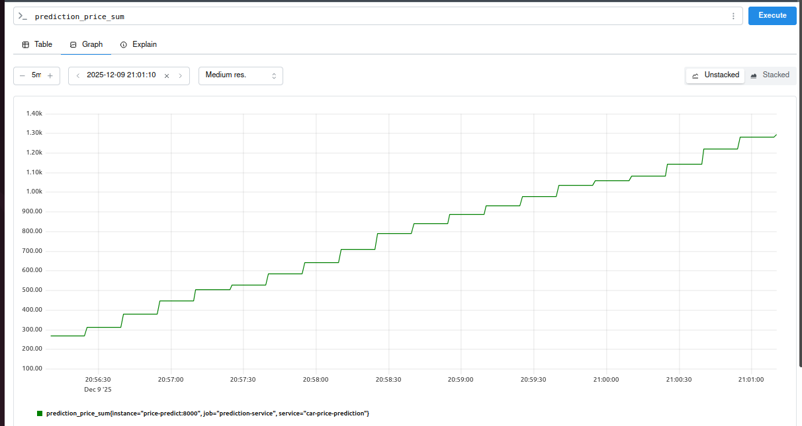
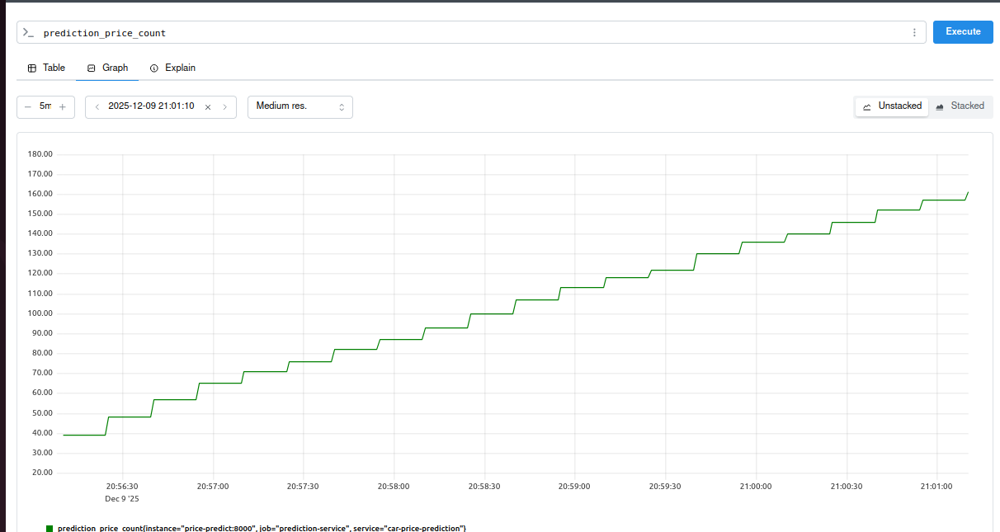
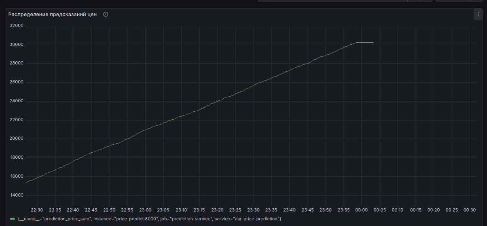
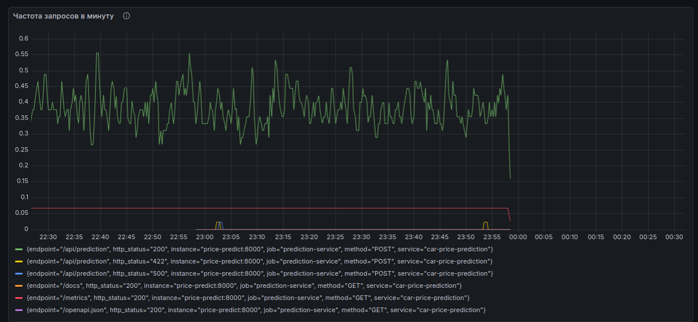
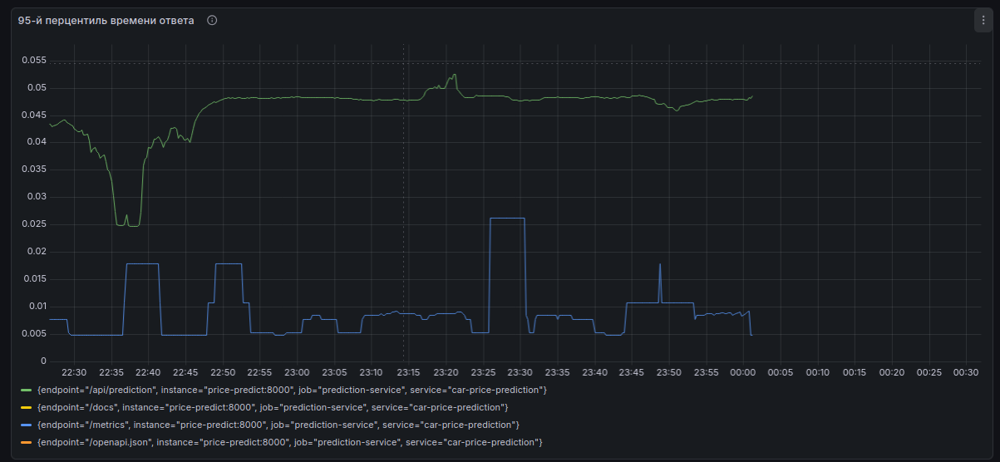
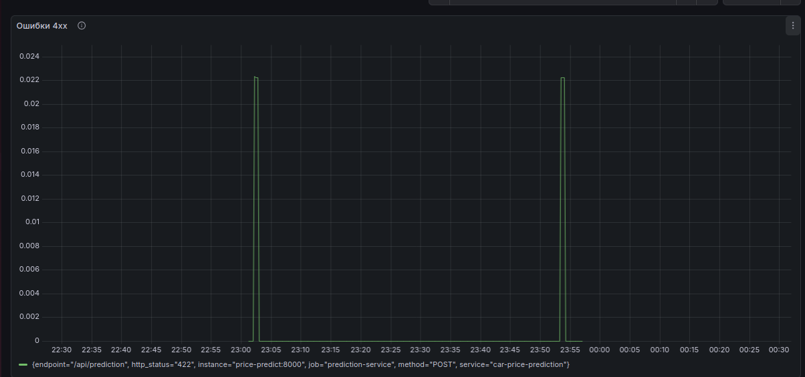
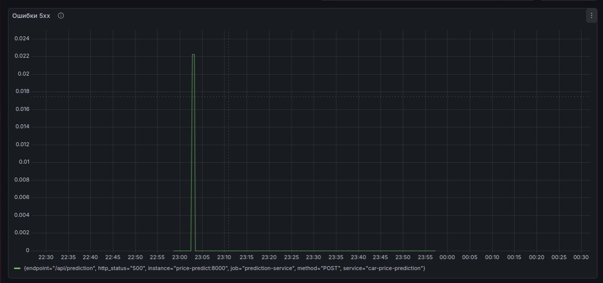

# Прогнозирование цен на автомобили

## Описание проекта
Проект представляет собой полноценную ML-систему для предсказания цен на подержанные автомобили. Решение включает полный цикл разработки: от исследования данных и обучения моделей до production-развертывания с микросервисной архитектурой, контейнеризацией и комплексным мониторингом.

## Ключевые особенности проекта:
- **End-to-end ML pipeline** - от сырых данных до production API
- **Микросервисная архитектура** - каждый компонент в отдельном контейнере
- **Профессиональный мониторинг** - Prometheus + Grafana для мониторинга
- **Production-ready** - health checks, логирование, обработка ошибок
- **Воспроизводимость** - Docker контейнеризация всех компонентов


## Ссылка на исходные данные: 
https://www.kaggle.com/datasets/vijayaadithyanvg/car-price-predictionused-cars

## Запуск проекта
Для запуска проекта необходимо выполнить команды:
```
git clone https://github.com/VolobuevaVA/intelligent_information_systems.git
```
```
cd intelligent_information_sistems
```
##  Создание виртуального окружения
```
python -m venv .venv_my_proj
```
```
source .venv_my_proj/bin/activate
```

##  Установка зависимостей
```
pip install -r requirements.txt
```

##  Исследование данных
Находится в ./eda/eda.ipynb

## Основные результаты предобработки данных:
Удалены автомобили с типом топлива CNG (слишком мало примеров)<br>
Удален признак количества владельцев (несбалансированные данные)<br>
Создана категоризация года выпуска (2003-2010, 2011-2015, 2016-2018)<br>
Марки автомобилей сгруппированы по частоте встречаемости<br>
Оптимизированы типы данных для уменьшения размера датасета
## Основные закономерности:
Тип топлива: Дизельные автомобили в среднем значительно дороже бензиновых <br>
Трансмиссия: Автомобили с АКПП дороже тех, что на механике<br>
Продавец: Дилеры продают более дорогие автомобили по сравнению с частными<br>
Год выпуска: Более новые автомобили имеют более высокую цену<br>
Пробег: Дизельные автомобили имеют больший средний пробег<br>
Текущая цена: Сильно коррелирует с ценой продажи
## Визуализации:
Использованы seaborn и bokeh для интерактивных графиков<br>
Показаны зависимости цены от различных факторов<br>
Выявлены ценовые сегменты по типам автомобилей<br>
## Примечание:
Обработанная выборка сохранена в файл ./data/car_clean_data.pkl

## Запуск MLFlow
MLFlow запускается из директории mlflow/
```
cd mlflow
```
```
sh start_mlflow.sh
```
Фреймворк будет доступен по адресу: http://localhost:5000

## Настройка моделей
Находится в ./research/research.ipynb

## Результаты исследования моделей
Лучшей показала себя Baseline модель (RandomForest) с метрикой MAE = 0.701<br>
- Модель: RandomForestRegressor<br>
- Версия: 9 (car_price_model)<br>
- Run ID: 4a08cd3868eb463baaee2dcbf614a72c<br>
- Признаки: Present_Price, Driven_kms, Fuel_Type, Selling_type, Transmission, Year_Category, Car_Frequency_Category

## ML Service
Микросервис для предсказания цен на автомобили с использованием ML модели.<br>
Сервис предоставляет REST API на основе FastAPI и запускается в Docker контейнере.

## Папка 'services/ml_service/':
- 'main.py' - основной файл FastAPI приложения, содержит endpoints:<br>
- 'GET /' - тестовый endpoint, возвращает '{"Hello": "World"}'<br>
- 'POST /api/prediction' - endpoint для предсказания цены автомобиля<br>
- 'api_handler.py' - класс-обработчик для загрузки ML модели и выполнения предсказаний<br>
- 'Dockerfile' - конфигурация для сборки Docker образа<br>
- 'requirements.txt' - зависимости сервиса (fastapi, uvicorn, pandas, scikit-learn, mlflow)<br>
- 'model_fixed.pkl' - сохраненная ML модель

## Папка 'services/models/':
- 'get_model.py' - скрипт для загрузки модели из MLflow по run_id<br>
- 'model.pkl' - исходная ML модель<br>
- 'model_fixed.pkl' - модель для работы в контейнере

## Сборка Docker образа:
```
cd services/ml_service
docker build -t car_price_service:1 .
```

## Запуск контейнера:
```
docker run -d -p 8000:8000 car_price_service:1
```

## Проверка работоспособности:
Открыть в браузере: http://localhost:8000/docs <br>

Протестируйте endpoint POST /api/prediction:<br>

## Параметры запроса:
```
item_id : 123
```
## Тело запроса (json):
```
{
  "features": [5.5, 50000, 1, 0, 1, 3, 2]
}
```
# Архитектура мониторинга

## Сервисы:
1. *prometheus* - система сбора метрик (порт 9090)<br>
2. *grafana* - дашборды мониторинга (порт 3000)<br>

*Файл в папке services/prometheus/:*
prometheus.yml - конфигурационный файл Prometheus

*Файл в папке services/grafana/:*
dashboard.json - экспортированный дашборд мониторинга в формате JSON

## Команды для работы с compose-проектом:
1. Запуск всех сервисов<br>
```
docker-compose up -d
```

2. Проверка статуса всех сервисов<br>
```
docker-compose ps
```
3. Просмотр логов в реальном времени<br>
```
docker-compose logs -f
```
4. Остановка всех сервисов <br>
```
docker-compose down
```
5. Проверка логов конкретного сервиса<br>
```
docker-compose logs prometheus --tail 50
docker-compose logs grafana --tail 50
```
## Сумма всех предсказаний
График показывает совокупную сумму всех предсказанных цен автомобилей с момента запуска сервиса. Эта метрика полезна для:
- Оценки общего объема "проходящих" через систему денежных средств<br>
- Выявления аномалий в работе модели (резкие скачки суммы)<br>


## Количество всех предсказаний
Общее количество сделанных предсказаний. Показывает нагрузку на модель и используется для:
- Подсчета общего объема работы модели<br>
- Оценки использования ресурсов<br>


## Ошибки 4хх и 5хх
График показывает две линии:
- **Синяя/первая линия:** клиентские ошибки 4xx (например, 400 Bad Request, 404 Not Found). Возникают при некорректных запросах от пользователей.
- **Оранжевая/вторая линия:** серверные ошибки 5xx (например, 500 Internal Server Error). Указывают на проблемы в работе самого сервиса.

## Дашборд Grafana:

### Прикладной уровень мониторинга:
**График: Гистограмма суммы предсказаний (prediction_price_sum)**

**Что отображает:** Совокупную сумму всех предсказанных цен автомобилей.  
**Назначение:**
- Мониторинг корректности работы ML модели
- Выявление аномальных предсказаний (data drift)


### Инфраструктурный уровень мониторинга
- **График** частота запросов (RPM)

- **График** 95-й перцентиль времени ответа

- **Их назначения:** мониторинг нагрузки и производительности инфраструктуры

### Прикладной уровень мониторинга:
- **График:** Ошибки 4xx

- **График:** Ошибки 5xx

- **Назначение:** мониторинг стабильности и доступности приложения